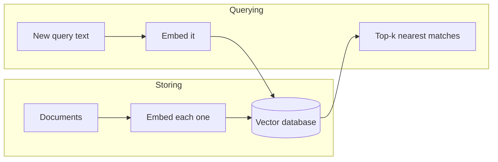

# Chapter 5: What Is a Vector Database, and Why?

Imagine a librarian who shelves books not alphabetically by title, but by what they're actually *about*, so that two books on similar topics end up right next to each other on the shelf, even if their titles have nothing in common. Hand her a brand-new book, and she doesn't scan every title in the building. She already knows roughly where it belongs, and walks straight there.

A **vector database** does exactly this with embeddings. It's a place to store the vectors you learned about in Chapter 4, built specifically so that finding "what's closest in meaning to this new thing" is fast, even when you're searching millions of them.

> **A bit of history:** the algorithm that made fast nearest-neighbor search practical at real scale, called FAISS, came out of Facebook AI Research in 2017. Dedicated vector database products built around that idea, like Pinecone, Weaviate, and Chroma, followed a few years later, mostly 2019 to 2022, once developers building search and RAG-style tools created real demand for this as its own category of software.

## Why Chapter 4's approach doesn't scale

In the Chapter 4 lab, you compared six sentences against each other with a plain Python loop: embed everything, then check cosine similarity between every pair by hand. That works fine for six sentences.

Now imagine a million documents instead of six. Every time you want to find the closest match to a new sentence, that approach means comparing it against all one million stored embeddings, one at a time, from scratch. That's slow, and it gets slower as your collection grows. A vector database solves this with smarter indexing, so it can find close matches without checking every single record.

## What a vector database actually stores and does

At its core, a vector database holds records that look like this:

| Field | Example |
|---|---|
| Embedding | `[0.12, -0.44, 0.08, ...]` |
| Original text | "my dog won't stop barking" |
| Metadata (optional) | `{"topic": "pets"}` |

You can add as many of these records as you want. Then, when you have a new piece of text, you embed it the same way, hand that new vector to the database, and ask for the **top-k nearest matches**, meaning "give me the k records whose embeddings are closest to this one." The database returns them fast, using an index built for exactly this kind of search, instead of comparing against every record one by one.

That optional metadata is also worth knowing about: most vector databases let you filter by it alongside the similarity search, for example "only search records where `topic` is `pets`." You won't need this yet, but it's a useful thing to know exists. Tier 2 covers it in more depth.



## Hands-on lab: store and query vectors locally

In this lab you'll store around ten sentences in a local vector database, then send in one new sentence and watch the database instantly return the closest matches, without ever comparing it to every sentence by hand.

Full instructions: [`labs/tier1-foundations/05-vector-db-basics`](https://github.com/fewshot-works/zero-to-agent/tree/main/labs/tier1-foundations/05-vector-db-basics)

Here's what you should see:

```
Adding 10 sentences to the vector database...

Query: "my cat keeps meowing at 3am"

Top 3 closest matches:
1. (0.89) my dog won't stop barking
2. (0.84) our puppy barks at everything
3. (0.21) this recipe needs more garlic
```

**One thing to know before you run it:** just like Chapter 4, this lab needs an embedding model, and Anthropic doesn't offer one. If your `.env` still has `PROVIDER=anthropic`, switch it to `ollama` or `openai` for this lab.

**Time:** 10 minutes. **Cost:** $0 with Ollama, a fraction of a cent with OpenAI.

## Checkpoint

<details>
<summary>What problem does a vector database solve that a plain Python loop doesn't?</summary>

Speed at scale. A loop comparing a new vector against every stored vector one by one works fine for a handful of items, but gets slow as the collection grows. A vector database uses an index built for nearest-neighbor search, so it can find close matches quickly even across millions of records.
</details>

<details>
<summary>What gets stored in a vector database record?</summary>

At minimum, an embedding and the original text it came from. Often also optional metadata, extra fields like a category or a source, that you can filter on alongside the similarity search.
</details>

<details>
<summary>What does "top-k nearest neighbors" mean?</summary>

Given a new vector, return the k stored vectors that are closest to it in meaning (k being however many results you asked for, like the top 3).
</details>

## What's next

You can now store text as searchable vectors and instantly pull back the closest matches. Chapter 6 puts that to work: instead of just returning matching text, you'll hand what you found to an LLM so it can answer a question using it. That combination has a name: RAG.
