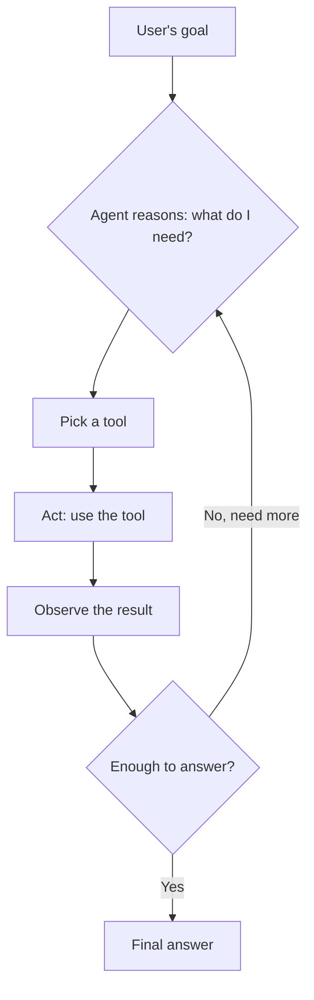

# Chapter 7: What Is an AI Agent?

A vending machine and a personal assistant can both get you a snack. Press a button on the vending machine and you get exactly what's behind that button, nothing more. Ask a personal assistant to "grab me something to eat" and they'll check what you like, notice the good bakery closed early today, decide to try the place next door instead, and come back with a decision they made along the way.

Everything you've built so far in this course, the plain chatbot in Chapter 2, the RAG bot in Chapter 6, works like the vending machine: one input goes in, one output comes out, following the same fixed steps every time. An **AI agent** works more like the assistant: it can decide what to do next based on what it learns, take multiple steps on its own, and use different tools along the way. This chapter is concept-only, no lab, just enough to recognize an agent when you see one before Tier 2 has you build one.

> **A bit of history:** the specific pattern most agents use today, reason about what to do, take an action, look at the result, repeat, comes from a 2022 paper called "ReAct" (Reasoning and Acting), from researchers at Princeton and Google. The idea went mainstream in early 2023 when a project called AutoGPT went viral for letting an LLM set its own sub-goals and chain tool calls together with no human in the loop. That same year, Meta published "Toolformer," showing a model could learn on its own when and how to call a tool. None of this needed a new kind of model, just a new way of prompting and looping the ones that already existed.

## The reasoning loop, not just a bigger prompt

A plain chatbot and a RAG bot both follow the same shape: get an input, do a fixed sequence of steps, produce an output, done. RAG's "fixed sequence" is a little longer, embed the question, search a vector database, stuff the results into a prompt, but it's still just one pass, decided in advance, every single time.

An agent adds a loop with a decision inside it. At each step, it asks itself: *do I have enough information to answer, or do I need to do something first?* If it needs something, it picks a tool suited to the job, uses it, looks at what came back, and asks that same question again. This keeps going until the agent decides it's done.

This loop needs two things a plain chatbot doesn't have:

1. **Tools**: things the agent is allowed to use, like a web search, a calculator, a database query, or a calendar lookup. Each tool does one narrow job well.
2. **A reason to stop**: the agent has to be able to recognize when it has enough to give a final answer, instead of looping forever.

## Walking through an example

Say you ask an agent: *"What's the weather where my flight lands tomorrow, and should I pack a jacket?"*

A plain chatbot can't answer this. It doesn't know your flight, and it has no live weather data, it can only guess or make something up. An agent works through it in steps:

1. **Reason:** "I need to know the flight's destination and arrival time first."
2. **Act:** call a flight-lookup tool with your itinerary.
3. **Observe:** the tool returns "Denver, landing 4 PM tomorrow."
4. **Reason:** "Now I need tomorrow's weather in Denver."
5. **Act:** call a weather tool for Denver.
6. **Observe:** the tool returns "38°F, light rain."
7. **Reason:** "I have what I need to answer."
8. **Final answer:** "Your flight lands in Denver at 4 PM, and it'll be 38°F with light rain, pack a jacket."

Notice that no human decided in advance to call a flight tool, then a weather tool, in that order. The agent worked that out for itself, one step at a time, based on what each previous step told it.

## Agents aren't magic

An agent is still an LLM predicting text, one token at a time, the same model you met in Chapter 2. Giving it a loop and some tools doesn't make it infallible. It can call the wrong tool, misread a tool's result, or get stuck looping without ever deciding it has enough. Production agent systems add guardrails for exactly this, limits on how many loops it can run, rules about which tools need human approval before they fire, that's Tier 2 and Tier 3 territory. For now, the goal is just recognizing the shape: reason, act, observe, repeat, until done.

## Checkpoint

What's the key difference between a RAG bot and an AI agent?

A RAG bot follows one fixed sequence every time: embed, search, answer. An agent runs a loop where it decides, at each step, what to do next based on what it has learned so far, and it can use more than one tool along the way.

What two things does an agent need that a plain chatbot doesn't?

Tools it's allowed to use (like a search function, a calculator, or an API call), and a way to recognize when it has enough information to stop looping and give a final answer.

In the flight and weather example, why couldn't a plain RAG bot answer the question?

It would need two separate pieces of live, personal information, your specific flight's destination and tomorrow's weather there, and it would need to look up the second one *using the result of* the first. A RAG bot only retrieves once, before answering; it can't make a decision partway through and go look something else up.

**Time:** ~10 minutes reading, no lab in this chapter. **Cost:** $0.

## Bonus: build this without code, in Langflow

The reasoning loop from this chapter can be wired up visually too, in [Langflow](https://www.langflow.org), the same free no-code tool from Chapter 6's bonus section. If you haven't installed it yet, follow the setup steps there first.

**Build the flow:**

1. Click **New Flow**, then pick the **Simple Agent** template. Unlike Chapter 6's template, this one needs no swapping, it already comes with a calculator tool and a URL-fetching tool wired straight into an Agent component.
2. Plug in a model: add your OpenAI or Anthropic API key, or point it at your local Ollama server the same way you configured Ollama Embeddings in Chapter 6's bonus.
3. Open **Playground** and ask something that needs both tools in a single question, for example: *"What's 15% of 340, and what does the top Wikipedia result for the Eiffel Tower say about when it was built?"*

Langflow shows you which tool the agent picked and what it got back at each step, so you can literally watch the reason, act, observe loop from earlier in this chapter happen in front of you, instead of imagining it.

Smaller local models are sometimes less reliable at picking the right tool than a larger hosted one. If the agent ignores a tool or answers from memory instead, that's not a bug, it's the exact "agents aren't magic" point from earlier in this chapter, showing up live. As a side note, Langflow can also expose any flow as an MCP server, letting other AI tools call it directly, that's beyond what this course covers, but good to know it's there if you go looking.

## What's next

You now know the vocabulary for everything this course has been building toward: embeddings (Chapter 4), vector databases (Chapter 5), retrieval-augmented generation (Chapter 6), and now agents that can reason, act, and loop. Chapter 8 pulls all of it together into a capstone project: a Q&A bot over your own documents, built from the pieces you've already used.
