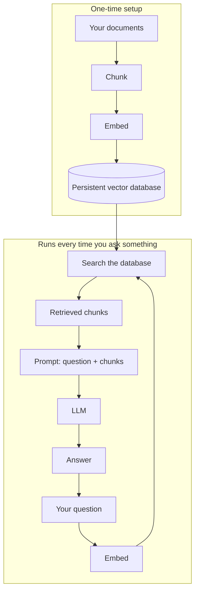

# Chapter 8: Capstone: A Q&A Bot Over Your Own Documents

This is the Tier 1 capstone. You've already built every piece of this, just not all at once. Chapter 2 sent a question to an LLM. Chapter 4 turned text into embeddings. Chapter 5 stored those embeddings in a vector database and searched them. Chapter 6 wired retrieval and generation together into a RAG bot. This chapter wires all of it into one bot, pointed at documents that are actually yours, that you can keep asking questions for as long as you want.

## What you already know, put together

| Piece | Where you learned it | What it does here |
|---|---|---|
| Sending a question to an LLM | Chapter 2 | Generates the final answer |
| Turning text into embeddings | Chapter 4 | Converts your documents and your questions into vectors |
| Storing and searching vectors | Chapter 5 | Finds the chunks most related to a question, fast |
| Retrieval + generation together | Chapter 6 | The core loop: retrieve relevant chunks, hand them to the LLM as context |

Two things are new in this chapter, and both are small steps, not new concepts:

1. **Persistent storage instead of one-off.** Chapter 6's bot rebuilt its vector database from scratch every time you ran it. This one saves it to disk (the same way Chapter 5's lab did), so it only has to embed your documents once, not every single run.
2. **A real question loop instead of one hardcoded question.** Chapter 6 asked exactly one question and stopped. This bot keeps asking "what's your next question?" until you tell it to quit, so you can actually use it.

## The full pipeline



## Hands-on lab: your own Q&A bot

The lab code lives in [`labs/tier1-foundations/08-capstone-qa-bot`](https://github.com/fewshot-works/zero-to-agent/tree/main/labs/tier1-foundations/08-capstone-qa-bot) in the course repo. It ships with two short, made-up sample documents about two unrelated fictional topics, a coffee shop and a hiking club, so you can see the bot correctly pull from the *relevant* one instead of just the only one it has. Full setup steps are in that folder's `README.md`.

**What you should see**, after asking a couple of questions:

```
Loading documents from ./docs...
Added 8 chunks from 2 documents to the vector database.

Ask a question (or type 'quit' to exit): What is Fernwood Coffee Co.'s most popular drink?

Retrieved context:
1. Fernwood Coffee Co. was founded in 2016 in a converted train depot...
2. The bestselling drink at Fernwood is the "Depot Latte"...

Answer: Fernwood Coffee Co.'s most popular drink is the Depot Latte.

Ask a question (or type 'quit' to exit): How often does the Mountain View Hiking Club meet?

Retrieved context:
1. The Mountain View Hiking Club meets every Saturday morning...
2. New members are welcome at any meetup...

Answer: The Mountain View Hiking Club meets every Saturday morning.

Ask a question (or type 'quit' to exit): quit
```

Once you've confirmed it works, do the actual capstone step: open the `docs/` folder, delete the sample files, and drop in a few of your own, notes, a resume, an FAQ you wrote, anything in plain text. Run the script again and ask it real questions about your own material.

## Checkpoint

<details>
<summary>Why does this bot use a persistent Chroma client instead of the in-memory one from Chapter 6?</summary>

So the documents only need to be embedded once. An in-memory database disappears the moment the script ends, so Chapter 6's bot had to redo that work on every single run. Saving it to disk means later runs can skip straight to answering questions.
</details>

<details>
<summary>What happens if you ask a question that isn't covered by either document?</summary>

The database still returns its top-k closest chunks, whatever they are, they just won't actually be relevant. The prompt tells the LLM to answer only from the provided context, so a well-behaved model should say it doesn't know rather than guessing. This is the same "reduces but doesn't eliminate hallucination" point from Chapter 6, a weaker model may still guess anyway.
</details>

<details>
<summary>What's the one change needed to point this bot at your own notes instead of the sample documents?</summary>

Nothing in the code. Just replace the files inside the `docs/` folder with your own `.txt` files; the script reads and chunks whatever `.txt` files it finds there.
</details>

**Time:** ~15-20 minutes. **Cost:** $0 with Ollama.

## What's next

That's Tier 1 complete. You went from "what even is AI" to a working, reusable Q&A bot over your own documents, understanding every piece along the way instead of copy-pasting a tutorial you couldn't explain. Tier 2 builds on all of it: better chunking strategies, choosing the right embedding model for the job, hybrid search and re-ranking, giving your bot proper tools to call, and a capstone of its own, a multi-tool agent that combines web search, a calculator, and RAG over your documents.
